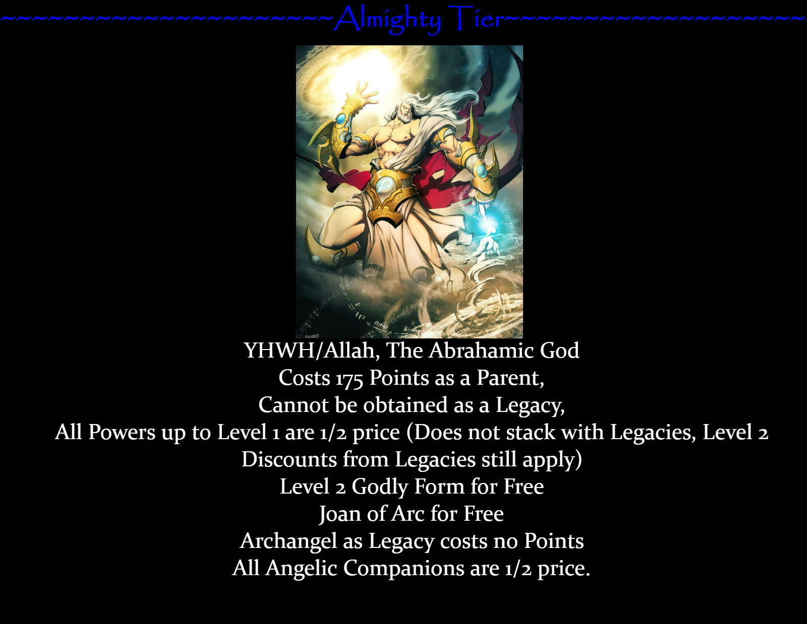

# [Demigod CYOA v1.5](https://imgur.com/gallery/xwyNW/)

## Starting
**Points: 430 Divinity Points (DP)**
- Can be used for Heritage, Powers, Armor, Weapons, Companion and Quests.

## Heritage

### Parent
- **Isis, Egyptian Goddess of Life and Magic, Queen of Egypt** (75 DP) (Free for all offered)
  - Power Bonuses:
    - **Level 2 Enhanced Healing**
    - **Level 2 Enhanced Magic**
    - **Level 1 Flight**
  - Companion Bonuses:
    - **Anubis**

- [x] Used Points: **75 DP**
- [x] Remaining Points: **355 DP**

### Legacies
- **Priapus, Roman God of Fertility** (15 DP) (1/2 Price for all offered)
  - Power Bonuses:
    - **Level 2 Enhanced Sex**
  - Special Bonuses:
    - **Harem Mode** - You can have sex with any and all companions. (Free)
- **Kronos, Greek Titan of Time** (30 DP) (1/2 Price for all offered)
  - Power Bonuses:
    - **Level 2 Time Manipulation**
    - **Level 2 Precognition**
    - **Level 1 Space Manipulation**
    - **Level 1 Super Speed**
    - **Level 1 Longevity**
  - Companion Bonuses:
    - **Max**
  - Special Bonus:
    - **ONE Weapon/Armor/Gift**
- **Quetzalcoatl, Aztec God of Creation and Wind** (35 DP)
  - Power Bonuses (1/2 Price):
    - **Level 2 Air Manipulation**
    - **Level 2 Flight**
    - **Level 1 Creation**
    - **Level 1 Super Speed**
    - **Level 1 Weather Manipulation**
    - **Any Wings**
  - Item Bonuses:
    - **The Dragon Ring**
  - Companion Bonuses:
    - **Draco**

- [x] Used Points: **80 DP**
- [x] Remaining Points: **275 DP**

### Greater Powers
- **Level 2 Enhanced Healing** (Free)
- **Level 2 Enhanced Magic** (Free)
- **Level 2 Flight** (6 DP)
- **Level 2 Enhanced Combat** (30 DP)
- **Level 2 Longevity** (21 DP)
- **Level 1 Super Strength** (18 DP)
- **Level 1 Super Speed** (9 DP)

- [x] Used Points: **84 DP**
- [x] Remaining Points: **191 DP**

### Manipulation Powers
- **Level 2 Time Manipulation** (21 DP)
- **Level 2 Space Manipulation** (29 DP)

- [x] Used Points: **50 DP**
- [x] Remaining Points: **141 DP**

### Form Powers - ???
- **Level 1 Creation** (13 DP)

- [x] Used Points: **13 DP**
- [x] Remaining Points: **118 DP**

### Lesser Powers
- **Level 2 Enhanced Cognition** (18 DP)
- **Level 2 Enhanced Perception** (12 DP)
- **Level 1 Enhanced Sex** (3 DP)
- **Angelic Wings** (3 DP)
- **Level 2 Technopathy** (18 DP)
- **Level 1 Enhanced Awarness** (14 DP)
- **Level 2 Enhanced Crafting** (18 DP)
- **Basic Enhanced Charisma** (2 DP)
- **Level 2 Enhanced Endurance** (18 DP)
- **Level 1 Empathy** (6 DP)

- [x] Used Points: **112 DP**
- [x] Remaining Points: **6 DP**

### Weapons/Armor/Gifts
<!-- - **Magi Staff** (10 DP) -->
- **Comforming Clothing** (10 DP)
- **Hermes' Cards** (8 DP)
- **The Dragon Ring** (5 DP) - **Quetzalcoatl's** & **Kronos's** Bonuses

- [x] Used Points: **23 DP**
- [x] Remaining Points: **-17 DP**

### Bases
<!-- - **The Aeolus House** (Free - **Level 2 Air Manipulation**) -->
- **The Pyramid** (Free - Legacy of **Quetzalcoatl**)
- **New York Penthouse** (Free - **Hermes' Cards**)
- **Saturn Base** (Free - Legacy of **Kronos**)
- **The Witch's Hut** (Free - **Level 2 Enhanced Magic**)

### Life Partners
- CYO - Hermione Granger (10 DP)

- [x] Used Points: **10 DP**
- [x] Remaining Points: **-27 DP**

### Mortal Companions
- Hermione (14 DP)

- [x] Used Points: **14 DP**
- [x] Remaining Points: **-41 DP**

### Drawbacks
- **Fated Death** (10 DP)
- **Hellbound** (10 DP) - REQ: **"Hell hath no Fury"** OR **"Hella"**
- **Intoxicated** (6 DP)
- **Tentalus** (8 DP)
- **Like Parent, Like Child** (8 DP)

- [x] Points Gained: **42 DP**
- [x] Remaining Points: **1 DP**

